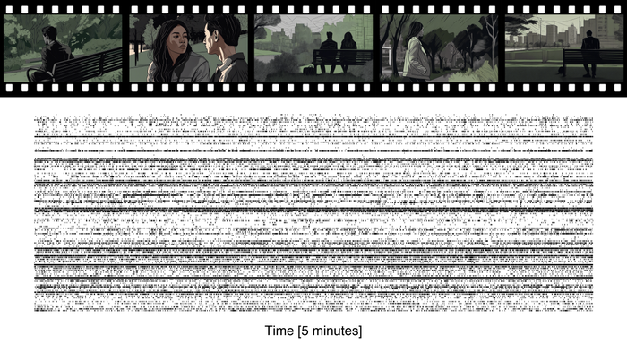

# SUMMER — Single Unit activity during a Movie in the human Medial Temporal lobe via Electrophysiological Recordings

[](https://doi.org/10.5281/zenodo.20328875) <a href="https://doi.org/10.48324/dandi.001616/0.260702.0824"><picture><source media="(prefers-color-scheme: dark)" srcset="https://shieldcn.dev/badge/dataset%20|%20DANDI%20ID-001616-A8656A.svg?size=xs&amp;mode=dark"></picture></a>

All code associated with the SUMMER dataset: NWB file generation, technical validation, movie stimulus synchronization, and result visualization. Implemented in Python and Matlab, with a conda environment file for reproducible setup.

A module for local database initialization is included for users who prefer a database-driven workflow, along with a tutorial for integrating it into existing pipelines. For the ML community, the repository provides a complete baseline training pipeline to go from download to model training with minimal configuration.

---

<p align="center">
  
</p>

---

## Folder structure

```
SUMMER/
├── data/                                # placeholder for the NWB files
│   ├── README.md
│   └── refactor_datafiles.py            # re-organize the DANDI-downloaded data into a flat hierarchy
├── ML_framework/                        # PyTorch Lightning training pipeline
│   ├── nwb_loading/                     # NWB loading and binning
│   │   ├── binning.py
│   │   └── nwb_loading.py
│   ├── dataloader.py                    # datasets and data modules
│   ├── model.py                         # LinearNextBin, LinearLabel models
│   ├── README.md
│   ├── requirements-train.txt
│   └── train.py                         # training script (CLI entrypoint)
├── movie_wrapper/                       # frame mapping and annotation visualization
│   ├── imgs/
│   ├── __init__.py
│   ├── README.md
│   ├── remap_video_frames.py            # remap frames between movie versions
│   ├── visualize_movie_frames.ipynb     # example notebook
│   ├── visualize_movie_frames.py        # visualize a DVD frame with NWB annotations
│   └── wrapper.py                       # map between paradigm and DVD frame numbers
├── nwb_generation/                      # nwb file generators and associated stats code
│   ├── stats/                           # scripts for spike sorting metrics
│   ├── utils/                           # processing modules for nwb file creation
│   ├── README.md
│   ├── session_info.py                  # session metadata
│   ├── write_nwb.ipynb                  # runner for building nwb files
│   └── write_nwb.py                     # classes for creating nwb files
├── paradigm_code/                       # code used to run the experiment
│   ├── modified_ffmpeg.zip              # compressed base code for the modified FFplay version
│   ├── README.md
│   └── timedDAQ                         # clocking application, compiled executable file
├── visualization/                       # plot code and figure generation
│   ├── figure_generation/               # svgutils-based panel assembly
│   │   ├── figure_annotations_overview/
│   │   ├── figure_annotations_vis/
│   │   ├── figure_data_overview/
│   │   ├── figure_decoding_results/
│   │   ├── figure_responsive_units/
│   │   ├── figure_splits/
│   │   └── tasks.py                     # invoke tasks (e.g. convertpngpdf)
│   ├── header_img/                      # images used in the documentation
│   └── plot_code/                       # scripts and config for individual plots
│       ├── annotations_overview/
│       ├── data_overview/
│       ├── decoding_results/
│       ├── fonts/
│       ├── responsive_units/
│       ├── spike_sorting/
│       ├── __init__.py
│       ├── config_colors.py
│       ├── config_plot_params.py
│       └── nwb_io.py
├── config_paths.py                      # shared path configuration
├── environment_no_builds.yml            # conda environment (no builds)
└── README.md
```

## Quick Start Guide

To quickly check out the dataset and the analysis:

1. Clone this repository locally.

2. Create a [conda](https://www.anaconda.com/docs/getting-started/miniconda/install/overview) environment with the required packages (requires conda version >24 and <26.1):  
  `conda env create -f environment_no_builds.yml`

3. Activate your conda environment: 
   `conda activate summer`

4. Get the data! You can download the data directly to a pre-set location in this repository using this comman, run from `~/SUMMER/`: 
   `dandi download DANDI:001616 --output-dir data` 

   If you want to save the data elsewhere, you can download the data from the [DANDI archive](https://dandiarchive.org/dandiset/001616) directly. 
   
   Update the file, `SUMMER/config_paths.py`, so that the variable`NWB_data_dir` matches your data location.

5. Organize the NWB files downloaded from DANDI by running the following via command line:

```python
python3 data/refactor_datafiles.py # This re-organizes the data files into a flat hierarchy (i.e. moves them out of the subdirectories).
```

6. Check out the Jupyter notebooks in `SUMMER/visualization/` to explore the data!

---

## Data

Download the NWB files from DANDI and place them in a folder named `data/` at the repository root:

```
SUMMER/
├── data/
│   ├── sub-1_ses-sub1_ecephys.nwb
│   ├── sub-2_ses-sub2_ecephys.nwb
│   └── ...
```

The NWB files follow the naming convention `sub-{patient_id}_ses-sub{patient_id}_ecephys.nwb`.

Following the Quick Start guide, the data is downloaded to this directory. 

If you would like to use this repository with a different location, set the path to your data folder in **`config_paths.py`**:

```python
NWB_data_dir = PROJECT_ROOT / "data"  # or an absolute path to your data folder
```

This variable is used by the visualization notebooks and the ML training pipeline to locate the NWB files.

---

## NWB & Stats

The **`nwb_generation/`** folder contains utilities for building the NWB files from the original neural datasets. 

The **`stats/`** subdirectory includes the modules used to calculate the spike sorting metrics.
The `write_nwb.py` contains the classes used to build the various containers and elements of the NWB files. The `write_nwb.ipynb` combines these classes to build each file. 

Note: the NWB generation code is included for demonstration purposes. 

---

## Movie wrapper

The **`movie_wrapper/`** folder contains utilities for synchronizing frame numbers across different versions of the movie stimulus.

The original movie has 125,743 frames. Because the DVD release differs in frame layout (a chapter break introduces an offset), `wrapper.py` provides functions to map between original (paradigm) frame numbers and their DVD equivalents:

- `wrapper_dvd(frame_number)` — converts a paradigm frame number to the corresponding DVD frame number.
- `inverse_wrapper_dvd(dvd_frame_number)` — converts a DVD frame number back to the paradigm frame number.

For more details, see **[movie_wrapper/README.md](movie_wrapper/README.md)**.

---

## Plot code and figure generation

The **`visualization/`** folder is split into two parts:

### plot_code

Notebooks and scripts for creating individual analysis plots, organized by topic (data overview, spike sorting, responsive units, decoding results, annotations). Shared configuration files define the color palette and matplotlib style used across all plots.

### figure_generation

Notebooks for composing publication-ready figures from individual plot panels. Figures are saved as SVGs and can be converted to PDF/PNG using the provided [Invoke](https://www.pyinvoke.org/) tasks.

For more details, see **[visualization/README.md](visualization/README.md)**.

---

## ML framework

The **`ML_framework/`** folder folder provides a complete PyTorch Lightning training pipeline for SUMMER NWB binned spike data, supporting two tasks:

- **Next-bin prediction** — predict the next bin's spike counts from the current bin (regression).
- **Frame-label prediction** — predict an annotation label for each bin from binned spikes (classification).

Supports single or multiple patients and optional buffer/fold-based train–val–test splits. Default: `bin_length=80` ms, `buffer=32` s, `fold=1`.

All requirements and configuration needed to get started are included. A training run can be launched with a single command:

```bash
python ML_framework/train.py --patient_ids 14 20 --max_epochs 10
```

For a quick start guide, installation instructions, and full argument documentation, see **[ML_framework/README.md](ML_framework/README.md)**.

---

## Development setup

A pre-commit hook is configured to strip outputs from Jupyter notebooks before each commit, so that committed notebooks stay clean. To use it, install pre-commit and enable the hooks (once per clone):

```bash
pip install pre-commit
pre-commit install
```

After that, the hook runs automatically on `git commit`. If it strips outputs from any notebook, stage the updated files and commit again.

