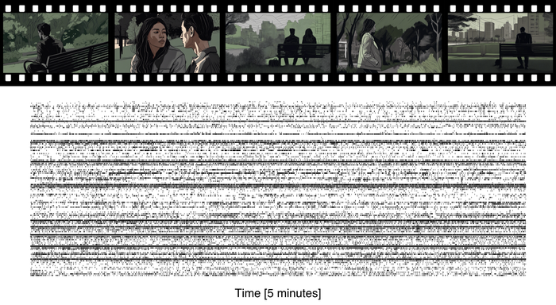

# SUMMER movie frame mapping

Utilities for synchronizing frame numbers across different versions of the movie stimulus used in the SUMMER dataset.

The original movie has **125,743 frames**. Because the DVD and HD releases differ in frame layout (chapter breaks, skipped frames), `wrapper.py` provides functions to map any original frame number to its equivalent in each version.

---

<p align="center">
  
</p>

---

## Folder structure

```
movie_wrapper/
├── README.md
├── wrapper.py                # frame-number mapping functions (DVD, HD)
```

---

## Functions

### `wrapper_dvd(frame_number)`

Converts an original movie frame number to the corresponding **DVD** frame number.

- **Input:** `frame_number` — integer in `[0, 125743]`.
- **Output:** the equivalent DVD frame number (integer).
- **Mapping:** frames 0–97211 are identity-mapped; frames above 97211 are offset to account for the DVD chapter break at frame 108232.

### `wrapper_hd(frame_number)`

Converts an original movie frame number to the corresponding **HD** frame number.

- **Input:** `frame_number` — integer in `[0, 125743]`.
- **Output:** the equivalent HD frame number (integer), or **`-1`** for frames beyond the HD version's extent (≥ 125730).
- **Mapping:** accounts for an initial offset, 16 single-frame skips spread across chapters, and the chapter break. Frames are adjusted cumulatively as they cross each skip boundary.

---

## How to use

```python
from movie_wrapper.wrapper import wrapper_dvd, wrapper_hd

# Map original frame 112537 to DVD and HD versions
dvd_frame = wrapper_dvd(112537)
hd_frame  = wrapper_hd(112537)

print(f"Original: 112537 → DVD: {dvd_frame}, HD: {hd_frame}")
```

---

## Notes

- Both functions raise an `AssertionError` if `frame_number` is outside `[0, 125743]`.
- `wrapper_hd` returns **`-1`** for frames ≥ 125730 because the HD version does not contain the final segment of the movie.
- The mapping logic is derived from manual alignment of chapter markers and skip frames between the original, DVD, and HD cuts.
