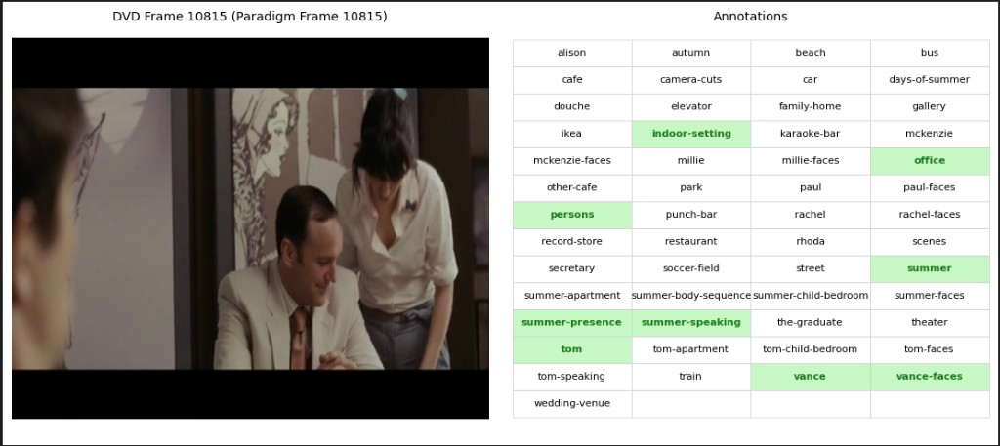

# SUMMER movie frame mapping

Utilities for synchronizing frame numbers across different versions of the movie stimulus used in the SUMMER dataset, and for visualizing per-frame annotations from NWB data files.

The original movie has **125,743 frames**. Because the DVD release differs in frame layout (a chapter break introduces an offset), `wrapper.py` provides functions to map between original (paradigm) frame numbers and their DVD equivalents.

---

<p align="center">
  
</p>

---

## Official DVD release

The official DVD release is the **Cine Project (2010 Release)** edition (EAN: 4010232049162, ASIN: B0030FXXLK). It introduces a chapter break at frame 108,232 but otherwise preserves the original frame order.

---

## Folder structure

```
movie_wrapper/
├── README.md
├── wrapper.py                       # frame-number mapping (paradigm ↔ DVD)
├── remap_video_frames.py            # extract & remap video frames via ffmpeg
├── visualize_movie_frames.py        # visualize a DVD frame with NWB annotations
└── visualize_movie_frames.ipynb     # example notebook for the visualization
```

### Data setup

The visualization function expects two user-provided directories:

- **Frames directory** — containing the DVD movie frames named `frame_NNNNNN.jpg` (zero-padded 6 digits).
- **NWB data directory** — containing the NWB files (e.g. `sub14.nwb`).

Both paths are passed as arguments when calling the function (see examples below as `frames_dir` and `data_dir`).

---

## Functions

### `wrapper_dvd(frame_number)` — `wrapper.py`

Converts a paradigm frame number to the corresponding **DVD** frame number.

- **Input:** `frame_number` — integer in `[0, 125,743]`.
- **Output:** the equivalent DVD frame number (integer).
- **Mapping:** frames 0–97,211 are identity-mapped; frames above 97,211 are offset to account for the DVD chapter break at frame 108,232.

### `inverse_wrapper_dvd(dvd_frame_number)` — `wrapper.py`

Inverts `wrapper_dvd`: given a DVD frame number, returns the paradigm frame number.

- **Input:** `dvd_frame_number` — integer (≤ 97,211 or ≥ 108,232).
- **Output:** the paradigm frame number (integer).
- **Raises** `ValueError` if the DVD frame falls in the gap (97,212–108,231) with no paradigm equivalent.

### `remap_movie_frames(video_path, output_dir, ...)` — `remap_video_frames.py`

Extracts all frames from a source video via ffmpeg and re-indexes them according to the DVD wrapper mapping, producing sequentially numbered PNGs in `output_dir`.

### `visualize_frame_with_annotations(frames_dir, dvd_frame_number, patient, ...)` — `visualize_movie_frames.py`

Displays a DVD movie frame side by side with its NWB annotation labels in a dense multi-column table. Active annotations for the given frame are highlighted in green.

---

## Visualizing frames with annotations

The visualization pipeline:

1. Loads the DVD frame image from `frames_dir` (expects files named `frame_NNNNNN.jpg`).
2. Applies `inverse_wrapper_dvd` to convert the DVD frame number to the paradigm frame number.
3. Loads the NWB file for the specified patient and retrieves all annotation indicator functions.
4. Checks which annotations are active (positive) for this paradigm frame.
5. Produces a figure with the movie frame on the left and a multi-column annotation table on the right.

### Usage via the notebook

Open `visualize_movie_frames.ipynb` and run the cells in order:

```python
import sys
from pathlib import Path

sys.path.insert(0, str(Path(".").resolve().parent))

from movie_wrapper.visualize_movie_frames import visualize_frame_with_annotations

FRAMES_DIR = Path("/path/to/frames")
DATA_DIR = Path("/path/to/nwb_data")

# Visualize a single frame
fig = visualize_frame_with_annotations(
    frames_dir=FRAMES_DIR,
    dvd_frame_number=10815,
    patient="14",
    data_dir=DATA_DIR,
)

# Save to disk
fig = visualize_frame_with_annotations(
    frames_dir=FRAMES_DIR,
    dvd_frame_number=10830,
    patient="14",
    data_dir=DATA_DIR,
    save_path="output/example_visualization.png",
)
```

### Usage from the command line

```bash
python -m movie_wrapper.visualize_movie_frames /path/to/frames 10815 14 --data-dir /path/to/nwb_data --save output/vis.png
```

---

## Using the wrapper functions directly

```python
from movie_wrapper.wrapper import wrapper_dvd, inverse_wrapper_dvd

# Paradigm frame → DVD frame
dvd_frame = wrapper_dvd(112537)
print(f"Paradigm 112537 → DVD {dvd_frame}")

# DVD frame → Paradigm frame
paradigm_frame = inverse_wrapper_dvd(dvd_frame)
print(f"DVD {dvd_frame} → Paradigm {paradigm_frame}")
```

---

## Notes

- `wrapper_dvd` raises an `AssertionError` if `frame_number` is outside `[0, 125,743]`.
- The mapping logic is derived from manual alignment of chapter markers between the original and DVD cuts.
- Dependencies: `matplotlib`, `pynwb`, `numpy`. Frame extraction in `map_frames.py` additionally requires `ffmpeg` and `ffprobe`.
