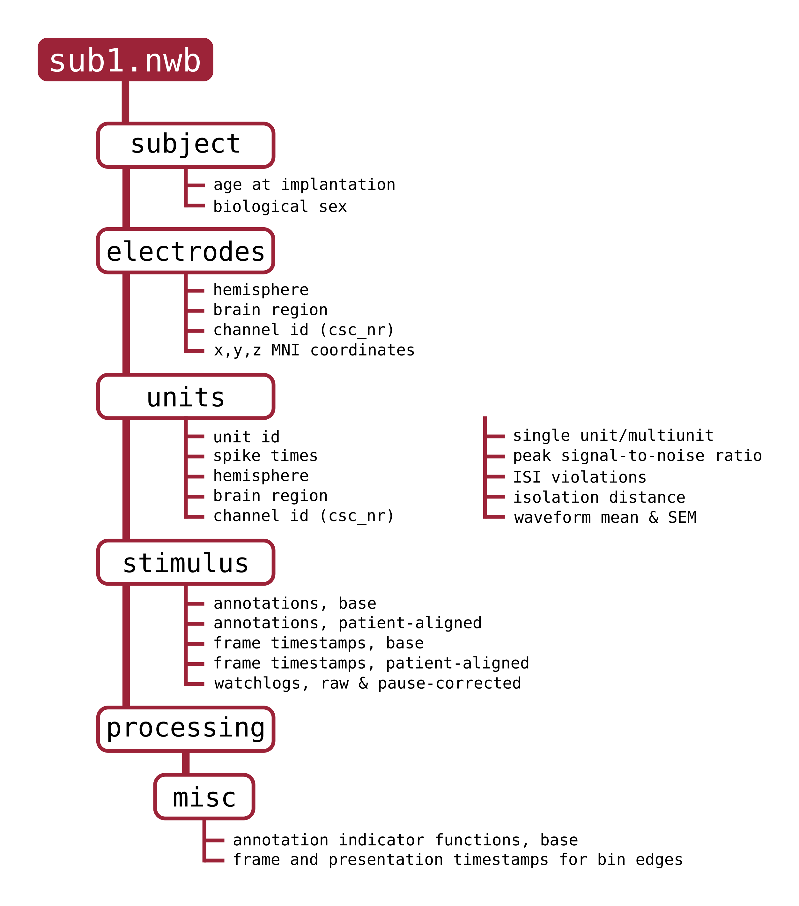

# NWB file generation

NWB file generators and spike sorting metrics. 

---

<p align="center">
  
</p>

---

## Folder structure

```
movie_wrapper/
├── README.md                           # overview of contents and use
├── stats/                              # modules for spike sorting metrics
│   ├── cell_type.py                    # categorize single-neurons into pyramidal or interneuron
|   ├── collect_mad_values.m            # collect median absolute deviation values from bandpassed channels*
|   ├── get_continuous_data.m           # read in and format LFP from NCS (Neuralynx) data records*
|   ├── median_absolute_deviation.m     # calculate median absolute deviation value
│   └── metrics.py
├── utils/
|   ├── data_io.py                      # misc. data handlers
│   └── process_labels.py               # convert between indicator functions and start/stop/value version of annotations
├── static_info.py                      # region names and label names
├── write_nwb.py                        # main functions for building nwb files*
└── write_nwb.ipynb                     # runner for building nwb files*
```

Asterisk denotes files included for demonstration.


---

## Overview of contents

The NWB generation code is included for completion and to demonstrate the file-building pipeline used in the SUMMER dataset. Files marked with an asterisk in the `Folder Structure` originally interface with patient data records and will therefore not work out-of-the-box. 

The main module is `write_nwb.py`. Each NWB component was created using a component-specific class, and all are included in the `write_nwb.py` script. 

An example generation runner is available in `write_nwb.ipynb`. 